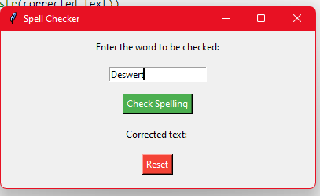
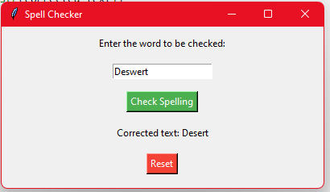

# Spell Checker with Colorful GUI

This is a simple spell checker application with a user-friendly and colorful graphical user interface (GUI). It allows users to enter a word or text, check for spelling errors, and see the corrected text.

## Features

- Large window size for better visibility.
- Colorful styling for a visually appealing interface.
- Spacing between the input field and buttons for improved layout.
- Check Spelling button to correct the entered text.
- Reset button to clear the input field and results.

## Requirements

- Python 3.x
- tkinter library (usually included with Python)

## How to Use

1. Run the script by executing the `spell_checker.py` file.

2. A GUI window will appear with the following components:
   - Input field: Enter the word or text you want to check.
   - "Check Spelling" button: Click to correct the text.
   - Result label: Displays the corrected text.
   - "Reset" button: Clears the input field and results.

3. Enter a word or text in the input field.

4. Click the "Check Spelling" button to correct the text. The corrected text will be displayed in the result label.

5. You can click the "Reset" button to clear the input field and results for a fresh spell check.

## Output

## Author

<a href="https://github.com/06RAVI06">RAVINDRA</a>

Feel free to use, modify, and distribute this spell checker with a colorful GUI as needed. If you have any questions or suggestions, please contact the author.

Happy spelling checking!

