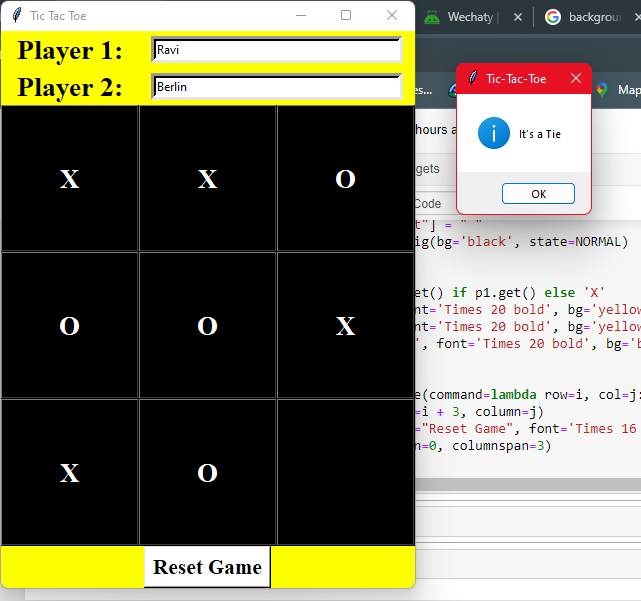
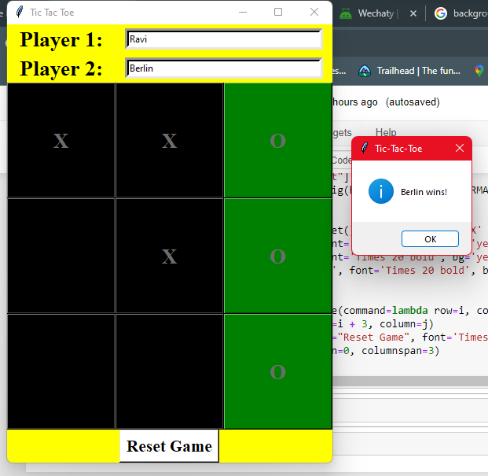
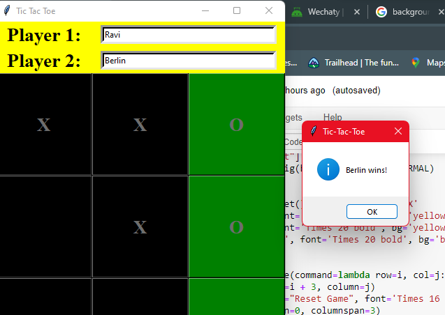

# TIC_TAC_TOE
TIC_TAC_TOE using Python and Tkinter
This is a simple Tic-Tac-Toe game implemented in Python using the Tkinter library for the graphical user interface. Players can enter their names in the provided text entry fields, and then take turns playing the classic Tic-Tac-Toe game on a 3x3 grid. The game logic checks for wins, ties, and provides an option to reset the game.

Here is a brief description of the key components and functionality of this code:
1. **Player Names**: Players can enter their names in the text entry fields provided.
2. **Game Grid**: The game grid is displayed as a 3x3 matrix of buttons, where players can click to make their moves.
3. **Winning Logic**: The code checks for winning conditions in rows, columns, and diagonals. When a player wins, the winning combination is highlighted in green, and a message box displays the winner's name.
4. **Tie**: If the game results in a tie, a message box announces it.
5. **Reset Game**: There is a "Reset Game" button to start a new game.
6. **Responsive UI**: The UI responds to player actions and updates the button text and color appropriately.
This code can be a simple and fun addition to your GitHub repository, allowing others to play Tic-Tac-Toe and learn from or contribute to the code. It provides a practical example of creating a basic game using Tkinter in Python.

## OUTPUT

