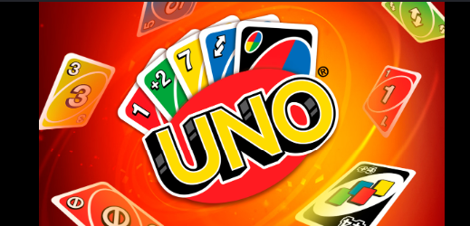
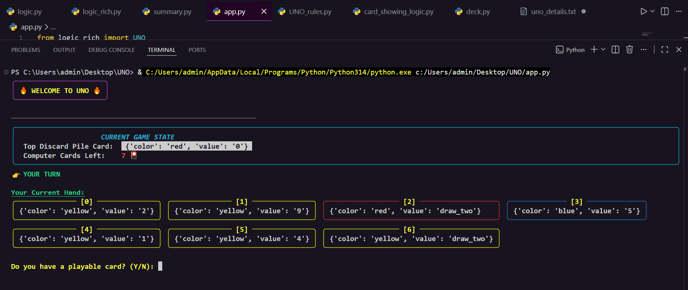
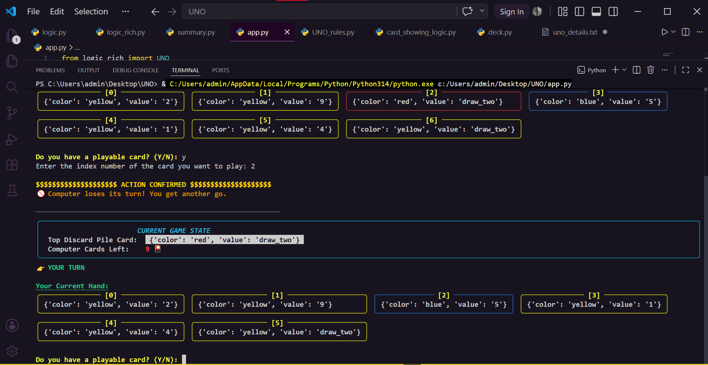

# 🎮 UNO Card Game - Python Edition

<div align="center">



**A Console-Based UNO Card Game Implementation in Python**

> Play against the computer in this exciting implementation of the classic UNO card game with a beautiful rich terminal UI.

[](https://www.python.org/)
[](LICENSE)
[](https://github.com/mayank-gariya/crazy-python-projects-/tree/main/UNO)

</div>

---

## 📋 Table of Contents

- [Overview](#overview)
- [Features](#features)
- [UNO Game Rules](#uno-game-rules)
- [Tech Stack](#tech-stack)
- [Project Structure](#project-structure)
- [Installation](#installation)
- [How to Play](#how-to-play)
- [Game Screenshots](#game-screenshots)
- [Future Enhancements](#future-enhancements)
- [Contributing](#contributing)

---

## 🎯 Overview

This is a console-based implementation of the classic **UNO card game** developed in Python. Challenge yourself against an intelligent computer opponent in a beautifully formatted terminal interface powered by the **Rich** library. The game provides an interactive experience with real-time card management, game state tracking, and detailed end-game summaries.

**Current Version:** 1-on-1 gameplay (You vs Computer)  
**Future Roadmap:** Multiplayer support, AI vs AI mode, and Online capabilities

---

## ✨ Features

✅ **Player vs Computer Gameplay** - Test your skills against an AI opponent  
✅ **Rich Terminal UI** - Beautiful, colorful console interface with Rich library  
✅ **Card Management** - Intuitive card selection and hand management  
✅ **Power Cards** - Draw Two, Skip, Reverse, Wild, and Wild Draw Four  
✅ **Smart Computer AI** - Computer makes strategic card plays  
✅ **Game Summary** - Detailed end-game statistics and winner announcement  
✅ **Real-time Feedback** - Instant notifications for game events (UNO!, card plays, etc.)  
✅ **Standard UNO Rules** - Fully compliant with official UNO game rules  

---

## 🎲 UNO Game Rules

### Basic Rules
- **Starting Hand:** Each player receives 7 cards
- **Deck:** Standard UNO deck of 108 cards in 4 colors (Red, Yellow, Green, Blue)
- **Objective:** Be the first to get rid of all your cards

### Card Types

#### Number Cards (0-9)
- Available in all 4 colors
- Must match either the **color** or **number** of the previous card

#### Action Cards
- **Skip** 🚫 - Next player loses their turn
- **Reverse** ↩️ - Changes direction (acts as Skip in 2-player mode)
- **Draw Two** 📥 - Next player draws 2 cards and loses their turn

#### Wild Cards
- **Wild** 🌈 - Can be played anytime; choose any color to continue with
- **Wild Draw Four** 🎪 - Can be played only when no other card matches; opponent draws 4 cards and loses turn

### Winning Condition
- **"UNO!"** is announced when a player has only 1 card left
- First player to empty their hand wins the game
- Game ends with a detailed summary showing rounds played and final statistics

---

## 🛠 Tech Stack

| Technology | Purpose |
|-----------|---------|
| **Python 3.7+** | Core game logic and implementation |
| **Rich** | Beautiful console UI with colors and formatting |
| **NumPy** | Optional numerical operations |
| **Random** | Card shuffling and AI decision-making |

### Installation Requirements
```bash
pip install rich
```

---

## 📁 Project Structure

```
UNO/
├── app.py                      # Main application entry point
├── logic_rich.py               # Enhanced game logic with Rich UI
├── logic.py                    # Core game logic engine
├── deck.py                     # UNO deck generation and management
├── UNO_rules.py               # Game rules and card validation
├── card_showing_logic.py       # Card display and formatting
├── summary.py                  # Game summary and statistics
├── requirenment.txt            # Project dependencies
├── uno.png                     # UNO game image
├── result.png                  # Gameplay screenshot 1
├── result2.png                 # Gameplay screenshot 2
└── README.md                   # This file
```

### File Descriptions

#### 🎮 **app.py**
- **Purpose:** Main entry point for the game
- **Contains:** Game initialization and startup
- **Usage:** Run this file to start playing

#### 🧠 **logic_rich.py**
- **Purpose:** Enhanced game logic with Rich library integration
- **Contains:** Player turns, computer AI, game flow control
- **Features:** Beautiful console output, real-time status updates

#### 🎯 **logic.py**
- **Purpose:** Core game logic implementation
- **Contains:** Game mechanics, turn management, hand tracking
- **Features:** Rule checking, card validation, turn cycling

#### 🃏 **deck.py**
- **Purpose:** UNO deck generation and management
- **Contains:** Standard deck creation (108 cards)
- **Features:** Card shuffling, deck initialization, custom deck sizes (optional 112-card variant)

#### ⚖️ **UNO_rules.py**
- **Purpose:** Game rules enforcement
- **Contains:** Card validation rules and power card effects
- **Features:** 
  - `check_rules_for_cards()` - Validates if a card play is legal
  - `apply_power_card()` - Handles special card effects

#### 🎨 **card_showing_logic.py**
- **Purpose:** Card display and formatting
- **Contains:** Console output formatting for cards
- **Features:** Visual card representation, hand display

#### 📊 **summary.py**
- **Purpose:** Game summary and statistics
- **Contains:** End-game results and player statistics
- **Features:** Winner announcement, game duration, round count

---

## 🚀 Installation

### Prerequisites
- Python 3.7 or higher
- pip (Python package manager)

### Steps

1. **Clone the Repository**
```bash
git clone https://github.com/mayank-gariya/crazy-python-projects-.git
cd crazy-python-projects-/UNO
```

2. **Install Dependencies**
```bash
pip install -r requirenment.txt
```

Or install Rich directly:
```bash
pip install rich
```

3. **Run the Game**
```bash
python app.py
```

---

## 🎮 How to Play

### Game Start
1. Run `python app.py`
2. The game initializes with both players receiving 7 cards
3. First card from the deck is placed as the initial discard pile card

### Your Turn (Player)
1. **View Your Cards:** Enter `show` to display all your cards with numbers
2. **Play a Card:** Enter the card number corresponding to your card
   - Valid cards must match the **color** OR **number** OR be a **Wild** card
3. **Draw a Card:** If you can't play, select "N" to draw a card
4. **UNO:** When you have 1 card left, "UNO!" is automatically announced

### Computer's Turn
- The computer automatically plays valid cards from its hand
- Draws a card if no valid play is available
- Strategic decision-making for card selection

### Game End
- The game ends when either player empties their hand
- **Winner Announcement** with detailed summary
- Game statistics including:
  - Total rounds played
  - Cards remaining for each player
  - Game duration

---

## 📸 Game Screenshots

### Gameplay Screenshot 1


### Gameplay Screenshot 2


---

## 🚀 Future Enhancements

### Phase 2: Multiplayer Mode
- [ ] Support for 2-10 players
- [ ] Network-based multiplayer
- [ ] Local multiplayer (hot-seat mode)

### Phase 3: Advanced AI & Modes
- [ ] **All Robots Mode** - Watch AI players compete autonomously
- [ ] **Difficulty Levels** - Easy, Medium, Hard computer opponents
- [ ] **Improved AI Strategy** - Smarter card selection and blocking tactics

### Phase 4: Online Capabilities
- [ ] **WebSocket Implementation** - Real-time multiplayer over internet
- [ ] **Server Architecture** - Central game server for matchmaking
- [ ] **Player Authentication** - User accounts and rankings
- [ ] **Web Interface** - Browser-based gameplay
- [ ] **Mobile Support** - Cross-platform compatibility

### Phase 5: Additional Features
- [ ] Game replay functionality
- [ ] Leaderboards and statistics tracking
- [ ] Custom rule sets
- [ ] Game history and replays
- [ ] Sound effects and animations

---

## 📊 Game Summary Details

After each game, you'll receive a detailed summary including:
- **Winner:** Who won the game
- **Rounds Played:** Total number of complete rounds
- **Game Duration:** Time taken to complete the game
- **Cards Played:** Total cards used in the game
- **Final Status:** Remaining cards in each player's hand

---

## 🤝 Contributing

Contributions are welcome! Here's how you can help:

1. **Fork** the repository
2. **Create** a feature branch (`git checkout -b feature/amazing-feature`)
3. **Commit** your changes (`git commit -m 'Add amazing feature'`)
4. **Push** to the branch (`git push origin feature/amazing-feature`)
5. **Open** a Pull Request

---

## 📝 License

This project is licensed under the MIT License - see the LICENSE file for details.

---

## 💡 Tips & Tricks

- 💰 **Strategic Plays:** Save your Wild cards for critical moments
- 🎯 **Memory:** Keep track of cards played to predict what's in the deck
- ⚡ **Speed:** In competitive mode, think fast and play faster
- 🛡️ **Defense:** Use Skip and Reverse cards to block opponents

---

## 📧 Contact & Support

**Developer:** Mayank Gariya  
**GitHub:** [mayank-gariya](https://github.com/mayank-gariya)  
**Repository:** [crazy-python-projects-](https://github.com/mayank-gariya/crazy-python-projects-)

---

<div align="center">

### 🎉 Enjoy the Game!

**Made with ❤️ in Python**


</div>
